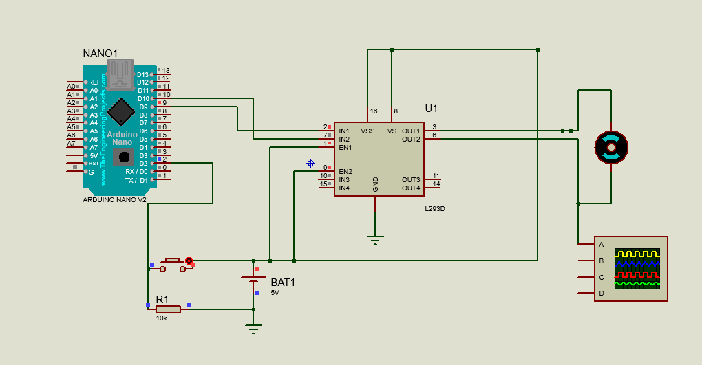

# Arduino_PWM_Controller
Repositório utilizado na matéria de Sistemas Embarcados na faculdade UNIMATER

1. [Introdução ao PWM](#introdução-ao-pwm)
2. [Componentes necessários](#componentes-necessários)
3. [Esquemático](#esquemático)
4. [Código-fonte](#código-fonte)
5. [Instruções de montagem](#instruções-de-montagem)
6. [Funcionamento do projeto](#funcionamento-do-projeto)


# introdução-ao-pwm

##### PWM (Pulse Width Modulation) ou Modulação por Largura de Pulso é uma técnica usada para controlar a quantidade de energia fornecida a uma carga sem a necessidade de alterar a voltagem constante. Em sistemas embarcados, o PWM é amplamente utilizado para controlar motores, LEDs, e outros dispositivos que precisam de ajustes de potência.

# componentes-necessários

#### Para realizar este projeto, você precisará dos seguintes componentes:

##### - 1 Arduino (qualquer modelo que suporte PWM, como Arduino Uno)
##### - 1 motor DC
##### - 1 botão
##### - 1 resistor (10k)
##### - L293D
##### - BAT (5V)
##### - GROUND

# esquemático



# código-fonte
```sh
#include <Arduino.h>

int button = 2;
int motor = 9;

int buttonState = 0;
int lastButtonState = 0;
int speedIndex = 0; 

void setup() {
  pinMode(button, INPUT_PULLUP);
  pinMode(motor, OUTPUT);
}

void loop() {
  buttonState = digitalRead(button);

  if (lastButtonState == LOW && buttonState == HIGH) {
    speedIndex++;
    if (speedIndex == 0) {
      analogWrite(motor, 255);
    } else if (speedIndex == 1) {
      analogWrite(motor, 191);
    } else if (speedIndex == 2) {
      analogWrite(motor, 127);
    } else if (speedIndex == 3) {
      analogWrite(motor, 64);
    } else if (speedIndex == 4) {
      analogWrite(motor, 0);
    } else if (speedIndex == 5) {
      analogWrite(motor, 255);
      speedIndex = 0;
    }
  }

  lastButtonState = buttonState;
}

```

# instruções-de-montagem

##### Monte o circuito conforme o esquemático fornecido.
##### Conecte o motor DC ao pino 9 do Arduino.
##### Conecte um terminal do botão ao pino 2 do Arduino e o outro terminal ao GND, utilizando um resistor de 10kΩ.
##### Certifique-se de que todas as conexões estão firmes e corretas.
##### Carregue o código-fonte no Arduino usando a IDE do Arduino.

# funcionamento-do-projeto

##### Quando o botão é pressionado e liberado, o estado do botão é lido pelo Arduino.
##### A cada pressão do botão, o índice de velocidade (speedIndex) é incrementado.
##### Dependendo do valor de speedIndex, o motor recebe um sinal PWM diferente, ajustando sua velocidade.
##### As velocidades configuradas no código são: 0% (255), 25% (191), 50% (127), 75% (64) e 100% (0).
##### Quando o índice de velocidade alcança 5, ele é resetado para 0, reiniciando o ciclo de controle de velocidade do motor.
